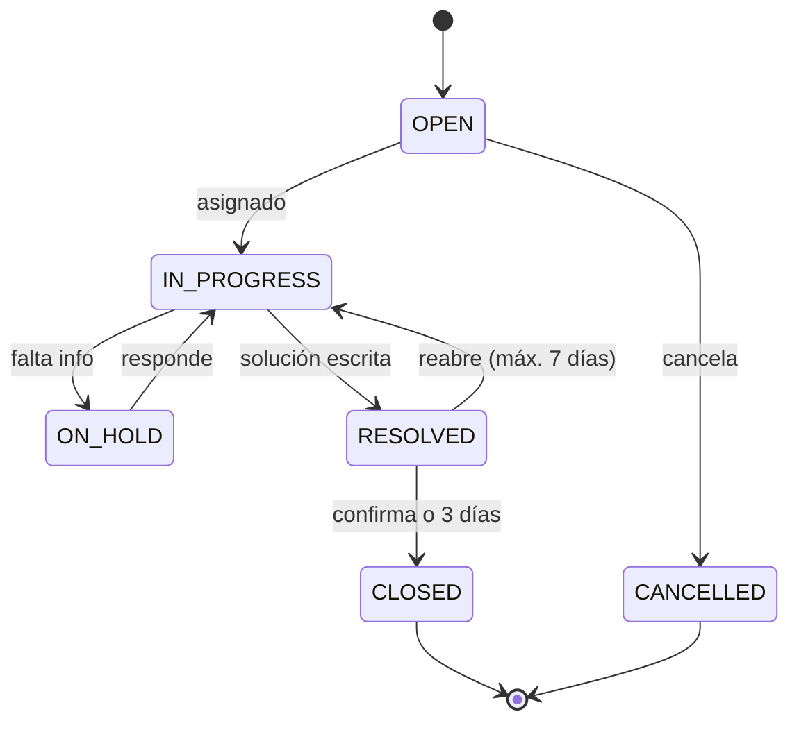
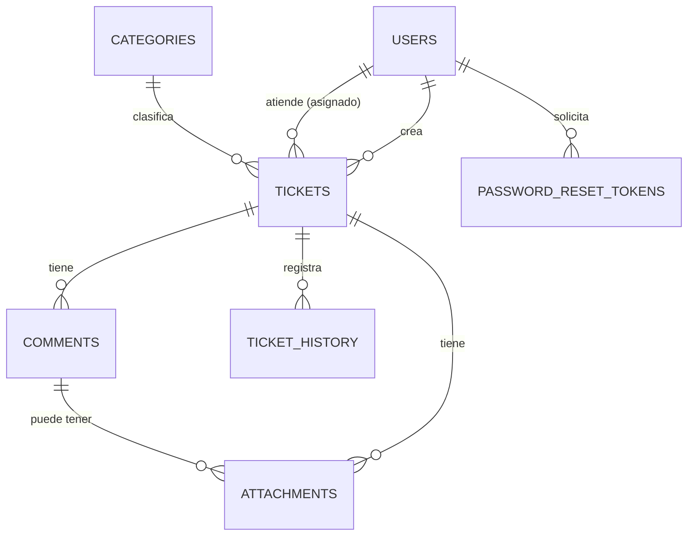

# TicketHub

Mesa de ayuda web: los usuarios reportan problemas, el equipo de soporte los atiende y todo queda registrado con folio, responsable, tiempos (SLA) y evidencia.

Proyecto final de **Sistemas de la Información** — FES Aragón, UNAM.

## Stack

| Capa | Tecnología |
| --- | --- |
| Backend | Java 21, Spring Boot 3.5, Maven |
| Seguridad | Spring Security + JWT |
| Datos | PostgreSQL 16, Spring Data JPA, Flyway |
| Archivos | S3 (MinIO en local) |
| Correo | Spring Mail (Mailpit en local) |
| Reportes | OpenPDF (PDF), Apache POI (Excel) |
| Pruebas | JUnit 5, Postman/Newman, k6 |
| Infra | Docker, docker-compose, GitHub Actions |

## Cómo levantarlo en local

**Requisitos:** JDK 21, Docker Desktop, IntelliJ IDEA (o Maven 3.9+).

1. Clona el repo:
   ```bash
   git clone https://github.com/<usuario>/tickethub.git
   cd tickethub
   ```
2. Levanta Postgres, MinIO y Mailpit:
   ```bash
   docker compose up -d
   ```
3. Corre la API desde IntelliJ (`TicketHubApplication`) o con Maven:
   ```bash
   ./mvnw spring-boot:run
   ```
4. Listo:
   | Qué | URL |
   | --- | --- |
   | API | http://localhost:8080 |
   | Swagger UI | http://localhost:8080/swagger-ui.html |
   | Health check | http://localhost:8080/actuator/health |
   | Bandeja de correos (Mailpit) | http://localhost:8025 |
   | Consola MinIO | http://localhost:9001 (minioadmin / minioadmin) |

Todo dockerizado, incluida la API:

```bash
docker compose --profile app up -d --build
```

Las variables de entorno están en `.env.example`. En local no necesitas cambiar nada.

## Estructura del proyecto

Arquitectura **por capas**: cada capa solo habla con la de abajo
(`controller` → `service` → `repository` → base de datos). La clase principal va en el paquete raíz
para que Spring escanee todo lo que está debajo.

```
src/main/java/com/tickethub
├── TicketHubApplication.java   # clase principal (@SpringBootApplication)
├── config/          # configuración general: Swagger, CORS, propiedades app.*
├── constants/       # constantes globales (rutas de la API)
├── controller/      # endpoints REST: reciben la petición y regresan DTOs
├── dto/
│   ├── request/     # lo que llega en el body (con validaciones)
│   └── response/    # lo que regresa la API
├── entity/          # "beans"/modelos: clases mapeadas a tablas con JPA
├── enums/           # Role, TicketStatus, Priority
├── exception/       # excepciones propias + manejador global de errores
├── mapper/          # convierte entity <-> dto
├── repository/      # acceso a datos (Spring Data JPA)
├── scheduler/       # tareas programadas (job del SLA)
├── security/        # SecurityConfig, errores 401/403, JWT (filtro y servicio)
├── service/         # interfaces con la lógica de negocio
│   └── impl/        # implementación de cada servicio
└── util/            # utilidades (generador de folio, etc.)

src/main/resources
├── application.yml
├── db/migration/    # scripts Flyway (V1__..., V2__...)
└── templates/email/ # plantillas HTML de correo (fase 4)

src/test/java/com/tickethub   # pruebas, mismo árbol de paquetes que main
postman/   k6/   docs/
```

**Flujo de una petición:**
`controller` → `service` (interfaz) / `service/impl` → `repository` → `entity` → `mapper` → `dto/response`.

**Reglas del equipo:**
- El controller no tiene lógica, solo llama al service.
- Nunca se regresa una entidad en la API, siempre un DTO.
- Los repositorios solo se usan desde los services.
- `util/` es solo para utilidades transversales; si algo pertenece a un tema (correo, archivos, JWT), va en su capa.
- Configuración propia en `application.yml` bajo `app:`, leída con una clase `@ConfigurationProperties` en `config/`.

## Diagramas

### Flujo de estados del ticket



### Modelo entidad-relación



### Arquitectura

_Pendiente: diagrama de arquitectura (frontend → API en capas → PostgreSQL / S3 / SMTP)._

## Cómo trabajamos (equipo)

- `main`: lo que está desplegado. Solo entra por Pull Request.
- `develop`: integración.
- Ramas de trabajo desde `develop`: `feature/auth-login`, `feature/tickets-crud`, `fix/...`
- Commits cortos y en presente: `feat: crear endpoint de login`, `fix: validar tamaño de adjunto`.
- Antes del PR: `mvn verify` en verde (lo mismo corre GitHub Actions).
- Nunca subir `.env` ni contraseñas reales.

## Pruebas

```bash
mvn test                                  # unitarias
newman run postman/TicketHub.postman_collection.json -e postman/local.postman_environment.json
k6 run k6/load-test.js                    # carga
```
